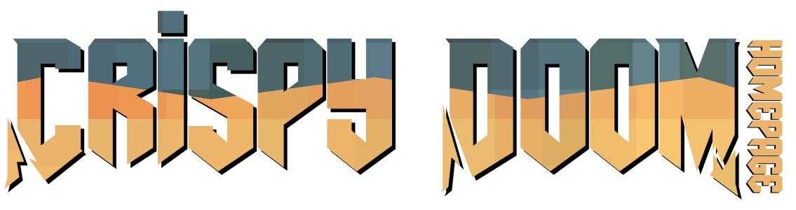

## About

This is the homepage of [Crispy Doom](https://github.com/fabiangreffrath/crispy-doom),
a limit-removing enhanced-resolution Doom source port based on [Chocolate Doom](https://github.com/chocolate-doom/chocolate-doom).

#### Base goals for the project:

-   Have a minimalistic, yet pretty looking homepage.
-   Avoid having useless text/content. Straight to the point without any bloat.
-   Be super fast to load.

#### Development notes:

-   Most of the website's text content is fetched from the [docs/ directory](https://github.com/fabiangreffrath/crispy-doom/tree/master/docs)
    of the Crispy Doom repo. See the [PageBuilder class](https://github.com/fabiangreffrath/crispy-homepage/blob/main/modules/PageBuilder.js).

-   In order to avoid using external libraries for simple things, most of the functionality
    is built from scratch ([image modals](https://github.com/fabiangreffrath/crispy-homepage/blob/main/modules/ModalController.js),
    [togglable divs](https://github.com/fabiangreffrath/crispy-homepage/blob/main/modules/ElementController.js),
    [background scroll effects](https://github.com/fabiangreffrath/crispy-homepage/blob/main/modules/BackgroundController.js)…).
    A static-site-generator might be used in the future if the content becomes too great to manage.

-   The only external library being used for the time being is [Marked](https://github.com/markedjs/marked), a markdown
    parser used to parse the docs (that are fetched from .md files) into html.

## License

-   The _source-code_, mostly contained within the _./modules_ directory
    is under the [GNU GPL-3.0 License](https://github.com/fabiangreffrath/crispy-homepage/blob/main/LICENSE).
-   The _assets_, which are all contained within the _./assets_ directory
    and are not under the same license. Each asset is owned by its respective author.
-   The [Marked](https://github.com/markedjs/marked) parser is under the [MIT License](https://github.com/markedjs/marked/blob/master/LICENSE.md).

## Acknowledgments

:pencil2: Doom font by [Amazingmax](https://www.dafont.com/amazdoom.font)
